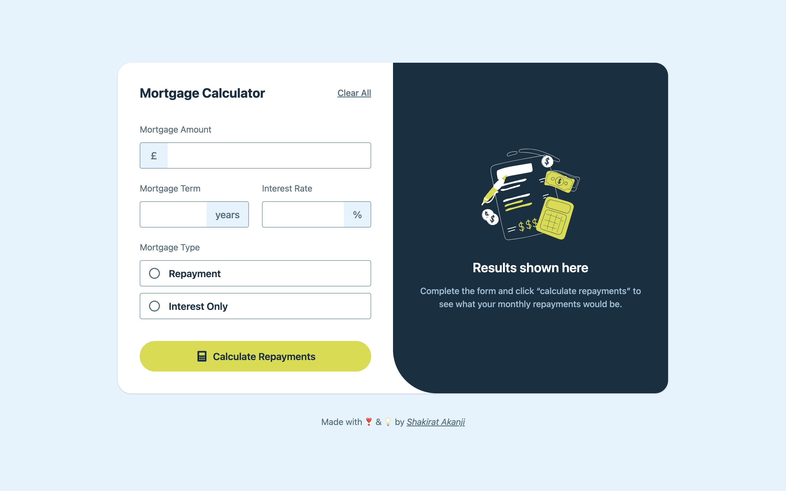
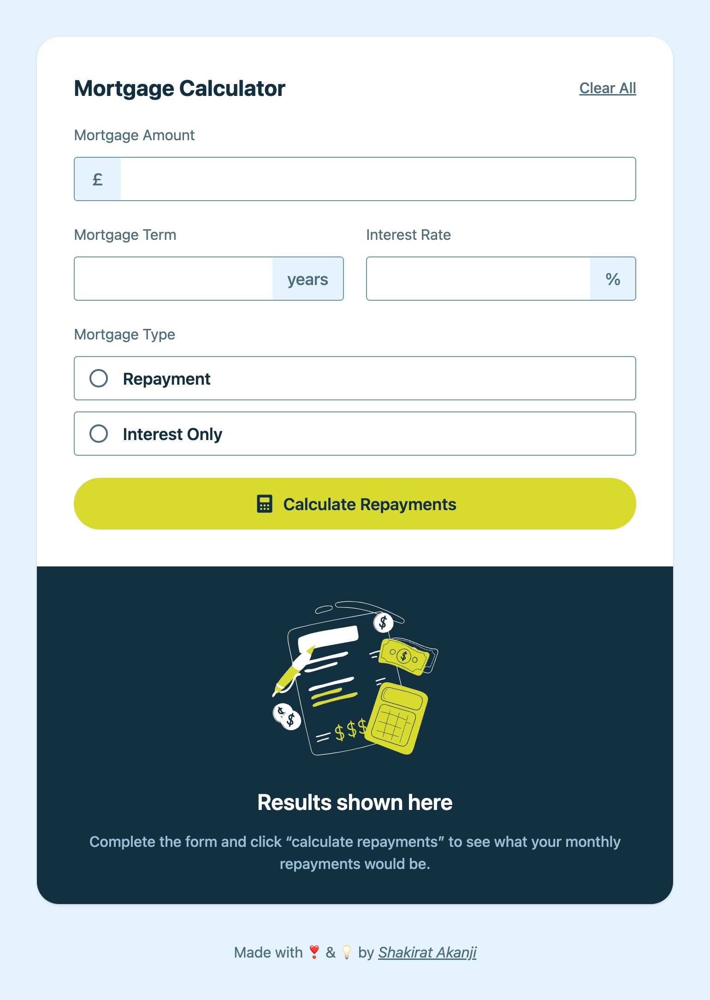

# 🏠 Mortgage Repayment Calculator

A responsive, interactive mortgage repayment calculator built with **React** and **TailwindCSS**.

This is a solution to the [Mortgage repayment calculator challenge](https://www.frontendmentor.io/challenges/mortgage-repayment-calculator-Galx1LXK73) on Frontend Mentor. Frontend Mentor challenges help you improve your coding skills by building realistic projects.

This tool helps users quickly calculate their **monthly repayment** and **total repayment** for both **repayment** and **interest-only mortgages**.

---

## 📋 The challenge

Users should be able to:

- [x] Input mortgage information and see monthly repayment and total repayment amounts after submitting the form
- [x] See form validation messages if any field is incomplete
- [x] Complete the form only using their keyboard
- [x] View the optimal layout for the interface depending on their device's screen size
- [x] See hover and focus states for all interactive elements on the page

---

## 🚀 Features

- 📊 **Two Mortgage Types**:

  - Repayment (principal + interest)
  - Interest-only

- 💰 **Dynamic Calculation**:

  - Calculates monthly repayments
  - Shows total repayment over the mortgage term

- 🎨 **Polished UI/UX**:

  - Built with TailwindCSS
  - Clean, mobile-first responsive design
  - Input formatting (e.g. £300,000 instead of 300000)

- ⚡ **Validation & Error Handling**:

  - Inline error states if fields are empty
  - Per-field error messages and styles

- 🧹 **Reset Functionality**:
  - Clear all fields and start fresh with one click

---

## 🖼️ Demo

👉 \*\*Live Demo
https://mortgage-calculator-gules.vercel.app/

  


---

## 🛠️ Built With

- **React** – component-based UI library
- **TailwindCSS** – utility-first CSS framework
- **JavaScript (ES6+)** – core logic and state management

---

## 📂 Project Structure

```
src/
├── components/
│   ├── Calculator.jsx     # Form UI & mortgage type selector
│   ├── InputField.jsx     # Custom input field with validation
│   ├── Results.jsx        # Results display section
├── App.jsx                # Main app container & logic
```

---

## ⚙ Getting Started

### Prerequisites

- Node.js (>= 14)
- npm (>= 6)

### Installation

1. Clone the repo:

   ```bash
   git clone https://github.com/your-username/mortgage-calculation.git
   cd mortgage-calculation
   ```

2. Install dependencies:

   ```bash
   npm install
   ```

3. Run the app locally:

   ```bash
   npm run dev
   ```

4. Open in your browser:
   ```
   http://localhost:5173
   ```

---

## 🧮 Example Calculations

- **Loan Amount:** £200,000
- **Term:** 25 years
- **Rate:** 5%

👉 Repayment Mortgage → **£1,169.18/month**  
👉 Interest-only Mortgage → **£833.33/month**

---

## 📖 Learning Objectives

By building this project I practiced:

- Handling **form inputs & validation** in React
- Managing **state** with `useState`
- Creating **reusable UI components** (InputField, Results)
- Implementing **mortgage repayment formulas** (annuity + interest-only)
- Improving UX with **inline error messages** and **formatted inputs**

---

## 🚧 Future Improvements

- [ ] Export amortization schedule (CSV / PDF)
- [ ] Support multiple currencies (£, $, €)
- [ ] Add dark mode

---

## 👩‍💻 Author

**Shakirat Akanji**

- GitHub: [@Anikhe00](https://github.com/Anikhe00)
- LinkedIn: [Shakirat Akanji](https://www.linkedin.com/in/shakirat-akanji/)
